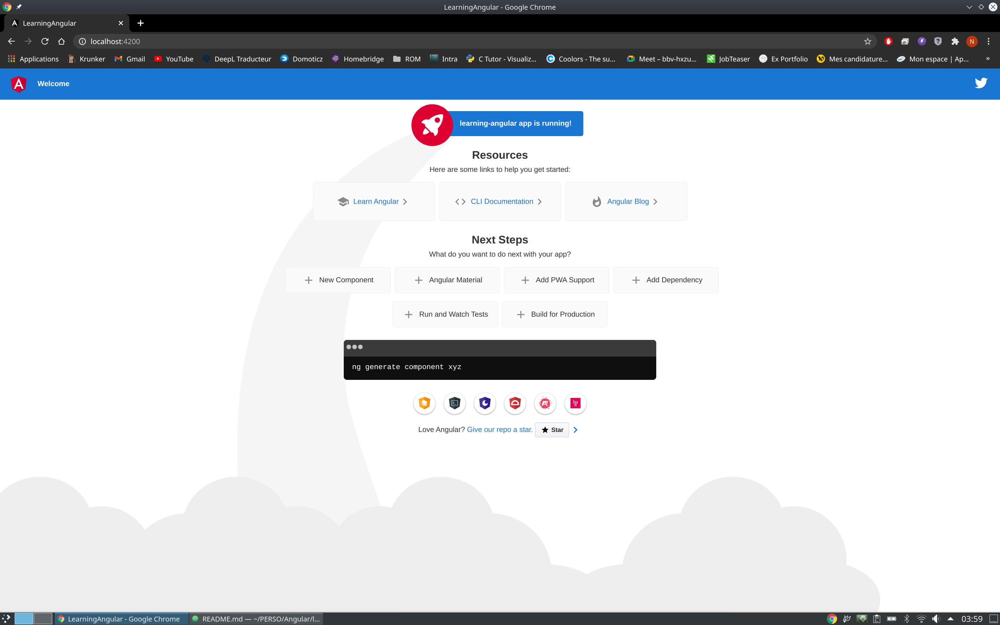
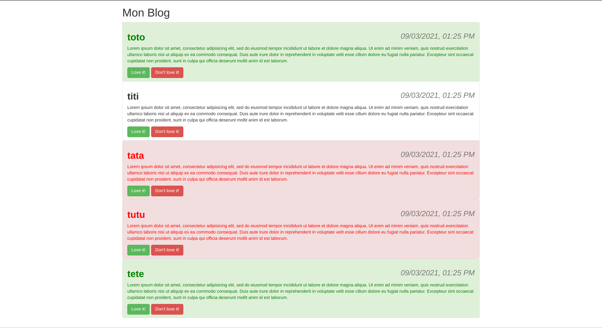
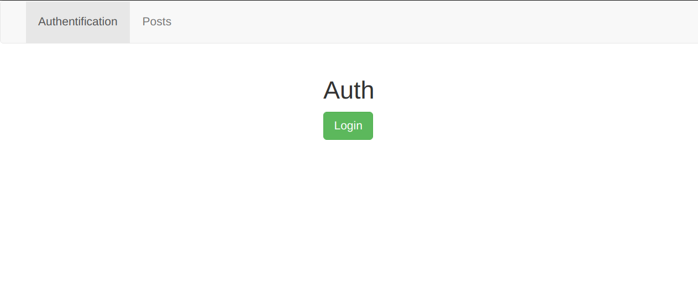
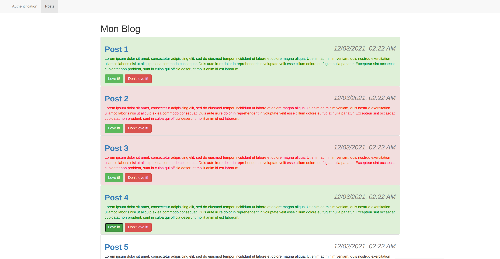
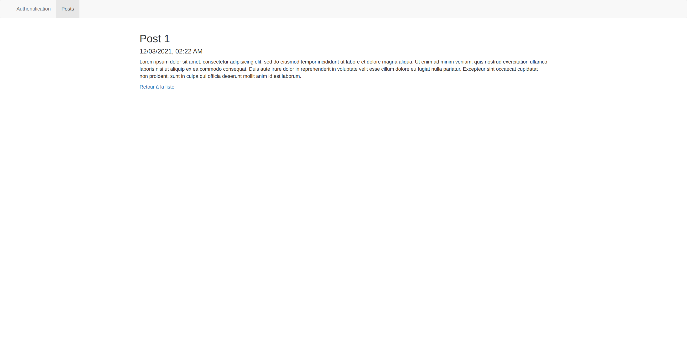
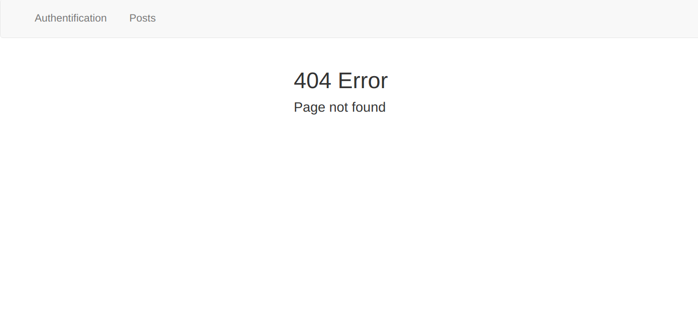

# learning_angular

Ce projet, qui est en cours de réalisation, a pour but de suivre et de vous partager ma progression dans l'apprentissage du framework [Angular](https://angular.io/).

J'utilise comme support les cours d'**OpenClassrooms**, disponibles à [cette adresse](https://openclassrooms.com/fr/courses/4668271-developpez-des-applications-web-avec-angular). Je partagerai dans ce `README.md` la démarche utilisée, mes résultats, etc.  

## Sommaire

- [Introduction à **Angular**](#introduction-à-angular)
  - [Description du framework](#description-du-framework)
  - [Installation des outils nécessaires](#installation-des-outils-nécessaires)
  - [Création de la première application](#création-de-la-première-application)
- [Création du premier **Component**](#création-du-premier-component)
  - [Construction du Component](#construction-du-component)
  - [Test du Component](#test-du-component)
- [Réalisation du premier projet](#réalisation-du-premier-projet)
  - [Objectif : créer un blog](#objectifs)
  - [Réalisation](#réalisation)
  - [Résultat](#résultat)
- [Amélioration du blog](#amélioration-du-blog)
  - [Création de services](#création-de-services)
  - [Gestion des routes](#gestion-des-routes)
  - [Blog final](#blog-final)


## Introduction à **Angular**

### Description du framework

**Angular** est un framework *open source*, écrit en **JavaScript** et basé sur **TypeScript**, développé par Google à partir de 2009. Il permet la création d'applications Web, généralement basées sur une seule page (« *Single Page Applications* ») afin de fournir une expérience utilisateur très fluide et légère comparé à un site web classique.

Très orienté front-end, ce framework est très populaire et majoritairement utilisé par les entreprises. De plus, l'intégration de *bootstrap* étant relativement aisée, l'utilisation du *TypeScript* se révèle un peu plus complexe à maîtriser, mais ouvre de nouvelles portes très intéressantes comme la programmation orientée objet, par exemple.

Assez parler, passons à l'installation !

### Installation des outils nécessaires

Je vais utiliser **[`Angular CLI`](https://cli.angular.io/)** pour créer mon application plus facilement.

D'abord, je commence par installer **[`NodeJS`](https://nodejs.org/en/)**, qui inclus **[`npm`](https://www.npmjs.com/)** :
```bash
# On va installer la dernière version de NodeJS v15
curl -fsSL https://deb.nodesource.com/setup_15.x | sudo -E bash -
sudo apt-get install -y nodejs
```

Une fois l'installation effectuée, je mets à jour `npm` vers la version `6.14.11` et vérifie les versions installées :

```bash
npm install -g npm@6.14.11

node -v                                               
#v15.9.0

npm -v
# 6.14.11 <-- J'utilise la version 6 de npm pour des raisons de compatibilité avec Angular
```

On peut maintenant installer `Angular CLI` de manière globale sur notre machine :
```
npm install -g @angular/cli
```

Cette interface nous propose plusieurs options dont nous aurons besoin ultérieurement, comme par exemple :
- `ng new <project-name>` : création d'un nouveau projet dans le répertoire actuel.
- `ng serve` : permet de lancer le serveur de notre application, et donc de la tester à l'adresse `localhost:4200`.

On peut donc passer à la création de notre première application Angular !

### Création de la première application

Nous allons enfin pouvoir créer notre application ; mais avant ça, jetons un œil aux deux flags importants que nous allons utiliser :
- `--style=scss` : on va simplifier la rédaction de notre *stylesheet* en incluant des fichiers en `scss` et non `css`. De plus, en vue de l'intégration de *bootstrap* à ce projet, l'utilisation de `scss` nous facilitera la tâche.
- `--skip-tests=true` : on ne crée pas de fichiers de tests unitaires pour l'instant, nous y reviendrons une fois plus à l'aise avec le framework.

Ce qui nous donne la commande :
```bash
ng new learning-angular --style=scss --skip-tests=true
```

On peut se rendre dans notre dossier `learning-angular` fraîchement créé pour y installer deux packages supplémentaires :
```bash
# On fait attention à ne pas inclure le flag -g ici : les packages doivent être installés localement (--save).
npm install bootstrap@latest --save

# Nous installons ce package pour un cours ultérieur.
npm install jquery@latest --save
```

On lance `ng serve` dans notre dossier, puis nous rendons à l'adresse `localhost:4200`. Voici ce qu'on obtient :



Tout est donc fonctionnel, nous allons alors commencer à la modifier !

## Création du premier Component

Je vais maintenant créer mon tout premier *Component* avec la commande `ng generate component <name>`.

### Construction du Component

Notre *component* est donc créé dans un sous dossier dans `src/app/`. Il est constitué de 3 fichiers :
- Un fichier *template* : `<name>.component.html`
- Un fichier de style : `<name>.component.scss`
- Un fichier *component* : `<name>.component.ts`

Également, le fichier `app.module.ts` est modifié pour que notre nouveau *component* soit disponible.

### Test du Component

On commence par créer un back-up du fichier `app.component.html`, puis nous le modifions pour qu'il ne contienne que cette ligne :
```html
<app-first></app-first>
```

> *first* est le nom choisi pour ce premier component (très original).

On se rend ensuite à l'adresse de notre application dans notre navigateur, où la phrase suivante doit apparaître:
```
first works!
```

Notre premier *component* est donc fonctionnel !


## Réalisation du premier projet

Nous allons maintenant réaliser notre premier projet avec ce que nous avons vu.

### Objectifs

L'objectif est de créer une ébauche de blog, qui affiche des posts constitués :
- d'un **Titre** de type *string*,
- d'un **Contenu** de type *string*,
- d'un nombre de **"likes"** de type *number*,
- d'une **date** de création de type *Date*.

L'array sera créé au préalable dans `blog/src/app/app.component.ts`.

### Réalisation

On commence par créer un nouveau projet Angular : `ng new blog --style=scss --skip-tests=true`
On y intègre directement *bootstrap* : `npm install bootstrap@3.3.7`

> L'utilisation de bootstrap 3.3.7 est propre à ce projet, pour suivre les exemples du cours en matière de mise en page

Puis nous créons notre *component* **Post** : `ng generate component post`

> Ce *component* servira à l'affichage de chaque post. Il sera appelé avec la directive `*ngFor`.

Nous commençons par générer notre *array* dans `app.component.ts` :
```ts
posts = [
  {
    title: 'toto',
    content: '[...]',
    loveIts: 0,
    created_at: new Date()
  },
  {
    title: 'titi',
    content: '[...]',
    loveIts: 0,
    created_at: new Date()
  },
  // [...]
];
```

Puis nous modifions `post.component.ts` pour y intégrer ces fonctions :
```ts
@Input() postTitle!: string;
@Input() postContent!: string;
@Input() postLove!: number;
@Input() postDate!: Date;

//[...]

getColor() {
  if (this.postLove > 0) {
    return 'green';
  } else if (this.postLove < 0) {
    return 'red';
  }
}

love() {
 this.postLove += 1;
}

hate() {
  this.postLove -= 1;
}
```

> Ici, `getColor()` va nous permettre de déterminer la couleur à appliquer à notre texte plus tard ; un article aimé sera vert, et à l'inverse, un article qui n'est pas apprécié sera rouge.

Maintenant, il faut configurer notre *template* `post.component.ts`. Rappelons qu'elle doit pouvoir s’exécuter autant de fois qu'il y a d'article.
```html
<li [ngClass]="{'list-group-item': true,
                'list-group-item-success': postLove > 0,
                'list-group-item-danger': postLove < 0}">
  <div class="pull-right">
    <h3 class="text-muted"><em>{{ postDate | date: 'dd/MM/yyyy, hh:mm a' }}</em></h3>
  </div>
  <h2 [ngStyle]="{color: getColor()}"><strong>{{ postTitle }}</strong></h2>
  <p [ngStyle]="{color: getColor()}">{{ postContent }}</p>
  <div class="btn-toolbar">
      <button class="btn btn-success "
              (click)="love()">Love it!</button>
      <button class="btn btn-danger "
              (click)="hate()">Don't love it!</button>
  </div>

</li>
```

Précisons quelques points :
- Nous créons donc un élément d'une liste (`<li>`) auquel nous appliquons une **classe dynamique** en fonction de `postLove` (le nombre de like). L’élément sera donc :
  - **Blanc** : même nombre de *likes* et de *dislikes*.
  - **Rouge** : Si le nombre de *dislikes* est supérieur au nombre de *likes* (article non apprécié).
  - **Vert**  : Si le nombre de *likes* est supérieur au nombre de *dislikes* (article apprécié).
- Nous affichons la **date** en haut à droite à l'aide d'une `<div>` avec la classe `pull-right`. Le texte sera en italique (`<em>`) et de couleur grise (classe `text-muted`). Nous formatons également cette date grâce à un `DatePipe` pour la rendre plus agréable visuellement.
- L'affichage du **titre** (en gras) et du **contenu** varieront en fonction du nombre de *likes* également grâce à la fonction `getColor()`.
- Enfin, on met en place 2 **boutons** :
  - Le premier invoque la fonction `love()` afin d'augmenter le nombre de *likes*
  - Le deuxième invoque la fonction `hate()` afin de diminuer le nombre de *likes*

Il ne nous reste plus qu'à adapter notre *template* `app.component.html` pour créer notre blog :
```html
<div class="container">
  <div class="row">
    <div class="col-xs-12">
      <h1>Mon Blog</h1>
      <ul class="list-group">
        <app-post  *ngFor="let post of posts"
                    [postTitle]="post.title"
                    [postContent]="post.content"
                    [postDate]="post.created_at"
                    [postLove]="post.loveIts"></app-post>
      </ul>
    </div>
  </div>
</div>
```

On remarque l'utilisation de la directive `*ngFor` qui permet de récupérer, un par un, les éléments d'un tableau. On peut donc facilement les faire passer à notre *post-component*.

Nous pouvons admirer le résultat maintenant !

### Résultat

Ci-dessous, une capture d'écran de mon blog fraîchement créé :



Comme expliquer durant la réalisation, les couleurs sont très explicites : les articles appréciés sont donc **toto** et **tete**, contrairement à **tata** et **tutu**. L'article **titi** reste neutre, en revanche.

L'intégralité de ce projet se trouve dans le dossier `blog/`.

## Amélioration du Blog

Suite à la réalisation de ce projet, j'ai décidé de l'améliorer afin de créer ma première *Single Page Application* en métant en place des **routes**. Aussi, j'ai décidé (afin d'obtenir un code plus clair) d'explorer les **services**. Avec ces derniers, je mettrai en place une émulation d'authentification afin de pouvoir accéder au Blog.

### Création de services

Pour mes besoins, j'ai prévu de créer 3 services différents :
- un `post.service` : son but est de stocker tous les posts du blog, mais aussi de déclarer des fonctions comme `addLike()` et `remLike()` qui ont pour but de gérer les likes.
- un `auth.service` : l'objectif est de mettre en place le statut de l'utilisateur lors du lancement de l'application (`isAuth = false`) puis de créer une fonction `login` et `logout`.
- un `auth-guard.service` : dans ce service, nous allons implémenter la méthode `CanActivate` afin de gérer si un utilisateur non-identifié à le droit ou nous d'accéder à un component.

> L'intégralité des services créés sont disponibles dans `blog/src/app/service`.

Voyons chaque service plus en détail maintenant.

#### `post.service`

```js
export class PostService {
  posts = [                  // Array contenant nos différents posts
    {
      id: 1,
      title: 'Post 1',
      content: 'Lorem ipsum dolor sit amet, consectetur adipisicing elit, sed do eiusmod tempor incididunt ut labore et dolore magna aliqua. Ut enim ad minim veniam, quis nostrud exercitation ullamco laboris nisi ut aliquip ex ea commodo consequat. Duis aute irure dolor in reprehenderit in voluptate velit esse cillum dolore eu fugiat nulla pariatur. Excepteur sint occaecat cupidatat non proident, sunt in culpa qui officia deserunt mollit anim id est laborum.',
      loveIts: 0,
      created_at: new Date()
    },
    // [...]
  ];

  addLike(i: number) {        // fonction pour ajouter un like
    this.posts[i].loveIts += 1;
  }

  remLike(i: number) {        // fonction pour retirer un like
    this.posts[i].loveIts -= 1;
  }

  getPostById(id: number) {   // permet de renvoyer un post entier à partir de son ID
    const post = this.posts.find(
      (s) => {
        return s.id === id;
      }
    );
    return post;
  }

}
```

Petite explication des fonctions ci-dessus :
- `addLike()` et `remLike()`: ajoute ou retire un like au post associé à l'`id` rentré en paramètre.
- `getPostById()` : renvoie l'intégralité du post associé à l'`id`.

#### `auth.service`

```js
export class AuthService {
  isAuth = false;

  signIn() {
    return new Promise(
      (resolve, reject) => {
        setTimeout(
          () => {
              this.isAuth = true;
              resolve(true);
          }, 2000
        );
      }
    );
  }

  signOut() {
    this.isAuth = false;
  }
}
```

- `signIn()` : fonction de *login*, simulée ou l'authentification est remplacée par un `setTimeout(), 2000` dans un premier temps.
- `signOut()` : fonction de *logout*

#### `auth-guard.service`

```js
import { ActivatedRouteSnapshot, CanActivate, RouterStateSnapshot, Router } from "@angular/router";
import { Observable } from "rxjs/Observable";
import { AuthService } from "./auth.service";
import { Injectable } from "@angular/core";

@Injectable()
export class AuthGuard implements CanActivate {

  constructor(private authService: AuthService,
              private router: Router) { }

  canActivate(
    route: ActivatedRouteSnapshot,
    state: RouterStateSnapshot): Observable<boolean> | Promise<boolean> | boolean {
      if (this.authService.isAuth !== true) {
        this.router.navigate(['/auth']);
      }
      return true;
    }
}
```

Ce service est un peu plus complexe que les deux derniers : il importe plusieurs méthodes comme `CanActivate` pour gérer l'accès à certains components, ou encore `Injectable` afin d'injecter un autre service (`auth.service`) dans ce dernier.

Revenons en détail sur l'implémentation de `CanActivate` -> cette interface va s’exécuter avant qu'un utilisateur essaye d'accéder à une route spécifique :
- S'il n'est pas identifié (`this.authService.isAuth !== true`) alors on le redirige vers `/auth`.
- On renvoie `true` pour permettre la redirection (vers `/auth` ou vers le component voulu).

Maintenant, configurons nos routes afin de gérer les redirections de notre *SPA*.

### Gestion des routes

Nous allons maintenant modifier le fichier `blog/src/app/app-routing-module.ts` afin de gérer nos routes :
```ts
import { NgModule } from '@angular/core';
import { RouterModule, Routes } from '@angular/router';

import { AuthGuard } from "./service/auth-guard.service";
import { AppComponent } from './app.component';
import { PostComponent } from './post/post.component';
import { FourOhFourComponent } from './four-oh-four/four-oh-four.component';
import { AuthComponent } from './auth/auth.component';
import { SinglePostComponent } from './single-post/single-post.component';
import { BlogViewComponent } from './blog-view/blog-view.component';

const routes: Routes = [
  { path: 'posts', canActivate: [AuthGuard], component: BlogViewComponent },
  { path: 'posts/:id', canActivate: [AuthGuard], component: SinglePostComponent },
  { path: 'auth', component: AuthComponent },
  { path: '', canActivate: [AuthGuard], component: BlogViewComponent },
  { path: 'not-found', component: FourOhFourComponent },
  { path: '**', redirectTo: 'not-found' }
];

@NgModule({
  imports: [RouterModule.forRoot(routes)],
  exports: [RouterModule]
})
export class AppRoutingModule { }
```

On commence par importer la totalité de nos components, ainsi que notre *guard*.

Nos routes sont configurées de la sorte :
- path de base (`localhost:4200`) : On applique notre *guard*, et on redirige vers `BlogViewComponent` (affichage de notre blog)
- path `posts` : similaire au path de base.
- path `posts/:id` : On applique notre *guard*, et on redirige vers `SinglePostComponent` (affichage d'un post précis, précisé par son `id`).
- path `auth` : renvoie `AuthComponent` afin de gérer l'authentification.

En plus, nous créons une route `not-found` afin d'appeler notre component `FourOhFour`, qui renvoie une erreur *404 Not Found*. Nous appellerons cette route pour chaque autre *path* non déclaré (`path: '**'`).

### Blog final

Ci-dessous, quelques screenshots de mon Blog :

Page d'authentification :


Page principale :


Page d'un seul post :


Erreur 404 :

